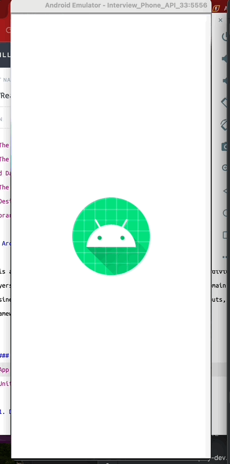
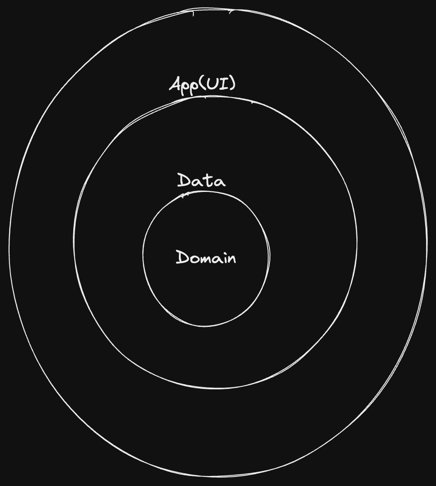

# RaboCSVReader Assignment

## CSV Reader App

This is a sample app to parse a CSV file from an internet source, process its contents, and handle data conversion in a Kotlin-based Android project. The app focuses on implementing a custom CSV parser, ensuring the use of proper data types (String, Integer, Date), and adhering to basic Android and Kotlin principles. UI and unit test cases exist for all usecases and methods used in this project.

## Requirements

- The application must download a CSV file from a given URL.
- The data in the file should be converted into appropriate data types: String, Integer, and Date.
- The application must be correctly implemented in Kotlin.
- Design and implement your own CSV parser, without relying on any third-party CSV parsing libraries.

## Architecture

This application is built using clean architecture principles, dividing the system into layers with dependencies pointing inward. At the core is the domain layer, containing business logic, while outer layers handle interactions with inputs, output and frameworks.A small diagram is shown below.

##### A CI pipeline has been setup with
- App build step
- Unit Tests

# 1. Domain Layer

This is a layer independent of framework dependencies. it contains the core business contracts. It encapsulates the contract for application-specific logic responsible for processing the CSV file.
Key Classes:
- FileDownloadUseCase: Use case for processing the downloaded CSV
- FileOperations: class which handles the saving of the file, using Kotlin Flow, it readily makes the file available for parsing after download. The flow approach ensures non-blocking, lazy loading of file content, improving memory efficiency.
- Result: A generic helper class that represents the success or failure of an action.

# 2. Data Layer
This layer is responsible for data management, fetching the CSV file, and persisting the parsed data. It includes:
- FileDownloadService: Handles the downloading of the CSV file.
- FileDownloadRepositoryImpl: Helps to fetch and produce a result after download
- Retrofit and it's dependencies

# 3. App (UI) Layer

The app follows the MVI (Model-View-Event) pattern for clear separation of concerns. The UI layer is responsible for presenting the data parsed from the CSV and handling user interactions.

###### Key Components:
- Model: Contains immutable data e.g the parsed Person objects.
- Views and Adapters: Displays data and responds to the user input (e.g., showing a list of parsed people from the csv).

- The MainViewModel: Manages the logic for downloading and parsing a CSV file while updating the UI through [shared state and shared flow](https://developer.android.com/kotlin/flow/stateflow-and-sharedflow)
  ###### Key Responsibilities of MainViewModel:
  - File Download: Handles downloading files using the FileDownloadUseCase and emits loading states or error messages as needed.
  - CSV Parsing: Reads the file line-by-line in batches, validating fields, and counting errors without stopping the entire process. delivrers the parsed list in batches to the view.
  - State and Effects: it Uses a StateFlow to manage continuous updates like the parsed list and error count.
  - Uses a SharedFlow for transient, one-time effects such as showing errors or loading indicators.

# 4. Core Layer
The Core Layer provides shared utilities and reusable logic needed across the Domain, Data, and UI layers. It helps reduce duplication and promotes consistency throughout the project.
###### Responsibilities
- Utilities: Common helpers, such as date formatting or string manipulation.
- Test Helpers: Mocking tools, sample data generators, or coroutine test utilities.

## **Architecture Design Highlights**

- Batched Processing: Processes CSV rows in batches for efficient state updates and UI rendering.
- Error Resilience: Tracks parsing errors while ensuring the process continues for valid rows.
- Reactive Updates: Provides clear separation between persistent state (parsed data) and transient events (loading/errors) to ensure a clean UI flow. This approach ensures efficient handling of large files, clear error reporting, and a responsive UI.

## Key Decisions

__CSV Parsing Algorithm__
- Convert Data Types: Each record in the CSV is parsed, with fields converted into appropriate types such as String, Integer, and Date. different date formats are used in case of inconsistent csv data, the user can still have meaninful information.
- Flow Emissions: The file is processed in batches, emitting parsed data for further use or display. This ensures that the user does not have to wait until the whole file is parsed in order to view the content of the CSV.
- The algorithm ensures efficient parsing of large files by emitting data in batches rather than loading everything into memory at once.

### **readLines() vs useLines()**

##### readLines()
Reads all lines from a file into memory as a List<String>. It is suitable for small files but can lead to memory issues with larger files since the entire content is loaded into memory at once.
##### useLines()
Lazily reads lines one by one as a Sequence<String>. This method processes lines only when needed, making it much more memory-efficient, especially for large files. It also ensures that the file is properly closed after processing.

#### Why useLines() Was Chosen

- Memory Efficiency: useLines() processes lines lazily, preventing memory overload when dealing with large files.
- Scalability: Efficient for handling large CSV files.
- Automatic Resource Management: It automatically closes the file after reading, preventing resource leaks.
- Better Performance: It offers better handling of large datasets without sacrificing performance.

#### Why ListAdapter?

I chose ListAdapter instead of the standard RecyclerView.Adapter for the following reasons:

- Efficient Updates with DiffUtil: ListAdapter is built on top of DiffUtil, which efficiently calculates the minimum changes required (insertions, deletions, updates) when the data list is updated. This is particularly useful in our app where:
- Batched Emissions: in this project, data is processed in batches and emitted through flows.
- Lastly, we avoid re-rendering the entire list and only update the affected items, which improves performance significantly.Managing data comparison using for DiffUtil integration while beeing Thread Safe, it's generally better for large lists

## Key Libraries Used

This project uses several important Kotlin and Android libraries:

- [Kotlin](https://kotlinlang.org/) - duh
- [Koin](https://insert-koin.io/): A smart Kotlin dependency injection
- [Turbine](https://github.com/cashapp/turbine) - Thin wrapper over a Channel with an API designed for testing.
- [RecylerView](https://developer.android.com/develop/ui/views/layout/recyclerview): makes it easy to efficiently display large sets of data
- [Retrofit](https://square.github.io/retrofit/): For handling network requests to download the CSV file.
- [Coroutines and Coroutine flow](https://kotlinlang.org/docs/coroutines-overview.html): To manage background tasks and ensure asynchronous operations.
- [Intrumented Tests with JUnit Runner](https://developer.android.com/reference/androidx/test/runner/AndroidJUnitRunner) - evented I/O for the backend
- [Mockk](https://mockk.io/) - mocking library for Kotlin
- [Espresso](https://developer.android.com/training/testing/espresso): for UI Testing.

## Conclusion
*This app adheres to best practices in Kotlin, using efficient methods to download, parse, and display CSV data. By implementing a custom CSV parser, handling data types correctly, and ensuring resource efficiency, the app is designed to scale well with larger files while maintaining good performance.*
